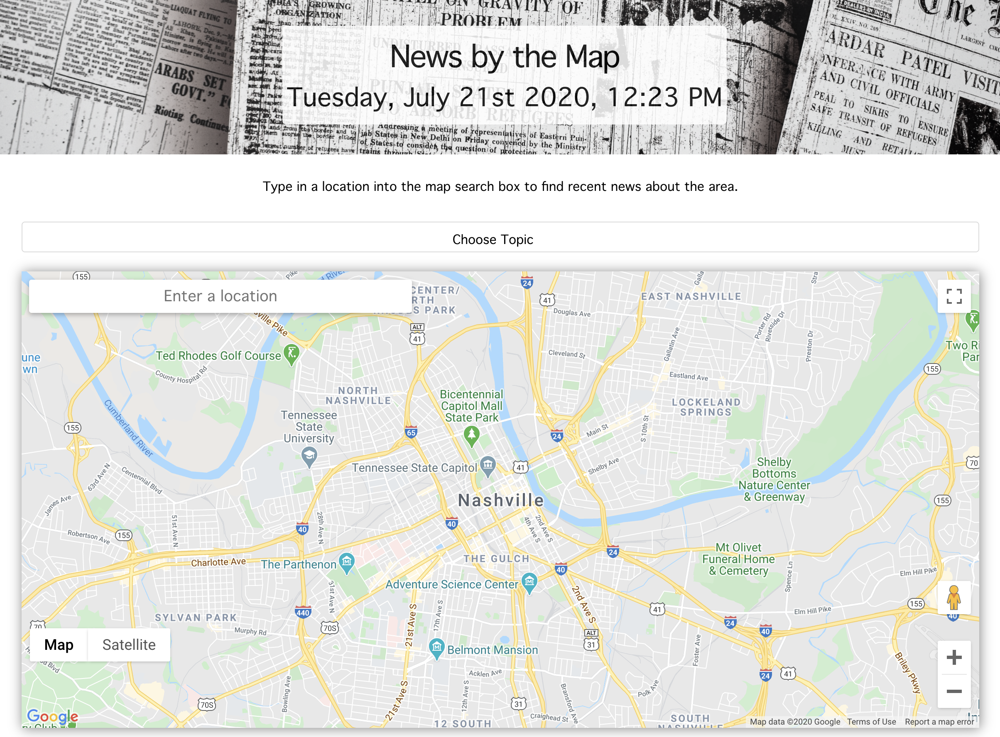
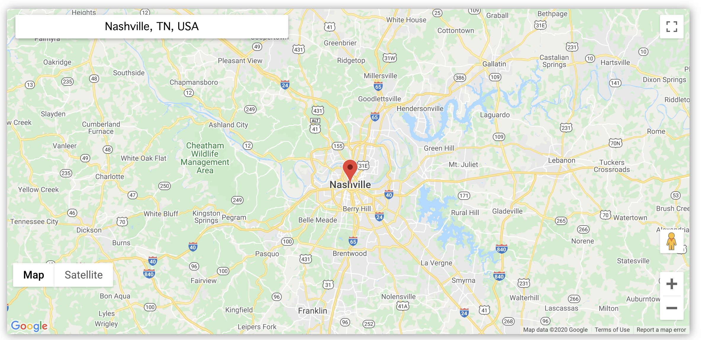
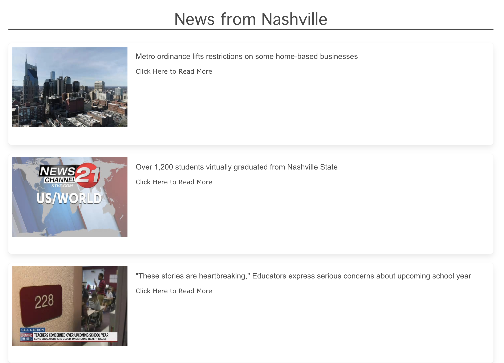

# newsbythemap
A news web application that provides news articles based off of location input. The user is given the option to pick a topic from a dropdown menu to filter their search and/or to enter a keyword. When the user searches for a city, they are provided with the top three news articles associated with that city and topic, if applicable. When the user views the three news clips for each city, they are presented with an image for the news article, the title, and a url link to the the full news article. When the user searches a city, it is added to their search history. When they click on a city in their search history, they are again presented with the top three news articles for that city.

## Built With
* HTML
* CSS
* JavaScript
* Bulma
* moment.js
* jQuery

## Website
https://adamkeyser45.github.io/newsbythemap/

## Screenshot

## Contribution
[Melanie Gilman](https://github.com/melaniegilman), [Jon Prine](https://github.com/jonprine), [Jessica Tillman](https://github.com/jtillson1),  [Adam Keyser](https://github.com/adamkeyser45), and [Mallory Korpics](https://github.com/mallynnk)

